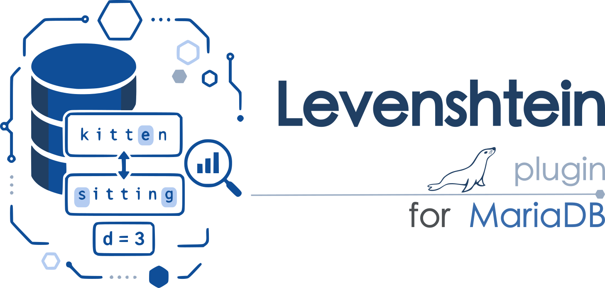

# mariadb-plugin-levenshtein



This plugin adds these native SQL functions:

- `LEVENSHTEIN(left, right)` returns the edit distance between two strings.
- `LEVENSHTEIN_RATIO(left, right)` returns a similarity from `0.0` to `1.0`,
  calculated as `1 - LEVENSHTEIN(left, right) / GREATEST(length(left),
  length(right))`. Two empty strings have a ratio of `1.0`.
- `LEVENSHTEIN_WITH_LIMIT(left, right, max_distance)` uses a banded
  calculation and returns `max_distance + 1` when the actual distance exceeds
  the non-negative limit.
- `DAMERAU_LEVENSHTEIN(left, right)` additionally counts an adjacent
  transposition as one edit. It implements optimal string alignment distance,
  so a substring cannot be transposed more than once.
- `DAMERAU_LEVENSHTEIN_RATIO(left, right)` normalizes that distance using the
  same formula as `LEVENSHTEIN_RATIO`.
- `LEVENSHTEIN_SIMILAR(left, right, threshold)` returns whether the
  Levenshtein ratio is at least `threshold`, which must be from `0.0` to `1.0`.
- `LEVENSHTEIN_EDITOPS(left, right)` returns a JSON array containing a minimal
  sequence of `insert`, `delete`, and `replace` operations. Positions are
  zero-based character offsets in the source and destination strings.
- `LEVENSHTEIN_WEIGHTED(left, right, insertion_cost, deletion_cost,
  substitution_cost)` calculates distance with non-negative integer costs.

All functions count characters according to each value's MariaDB character
set, propagate `NULL`, and compare Unicode code points exactly. Invalid limits,
thresholds, and costs return `NULL`.

## Build

Place or symlink this directory at `plugin/levenshtein` in a MariaDB server
source tree, configure MariaDB with CMake, then build the module:

```sh
cmake -S . -B build
cmake --build build --target levenshtein
```

Install the generated module in MariaDB's plugin directory and load all
function plugins:

```sql
INSTALL SONAME 'levenshtein';

SELECT LEVENSHTEIN('kitten', 'sitting');       -- 3
SELECT LEVENSHTEIN_RATIO('kitten', 'sitting'); -- 0.571429
SELECT LEVENSHTEIN('café', 'cafe');            -- 1
SELECT LEVENSHTEIN_WITH_LIMIT('kitten', 'sitting', 2); -- 3
```

The difference between `LEVENSHTEIN()` and `DAMERAU_LEVENSHTEIN()` is how
they handle adjacent characters entered in the wrong order:

```sql
SELECT LEVENSHTEIN('form', 'from');         -- 2
SELECT DAMERAU_LEVENSHTEIN('form', 'from'); -- 1
```

Standard Levenshtein needs two substitutions to change `form` into `from`.
Damerau-Levenshtein recognizes the adjacent `o`/`r` transposition as one
edit. For insertions, deletions, and ordinary substitutions, the two functions
behave the same.

`UNINSTALL SONAME 'levenshtein'` removes all functions.

## Run the MTR tests

The plugin contains a MariaDB Test Runner suite in
`mysql-test/levenshtein`. From the root of the MariaDB server source tree,
configure the plugin and build the server, test client, and plugin:

```sh
cmake -S . -B build -DPLUGIN_LEVENSHTEIN=DYNAMIC
cmake --build build --target mariadbd mariadb-test levenshtein
```

Then run the complete plugin suite from the build tree:

```sh
cd build/mysql-test
perl mariadb-test-run.pl --suite=levenshtein
```

## Comparison with PostgreSQL and MySQL

| Capability | This MariaDB plugin | PostgreSQL | MySQL |
|---|---|---|---|
| Standard Levenshtein distance | `LEVENSHTEIN()` | `fuzzystrmatch.levenshtein()` | No built-in equivalent |
| Bounded/accelerated distance | `LEVENSHTEIN_WITH_LIMIT()` | `fuzzystrmatch.levenshtein_less_equal()` | No built-in equivalent |
| Weighted edit costs | `LEVENSHTEIN_WEIGHTED()` | Cost arguments accepted by `levenshtein()` and `levenshtein_less_equal()` | No built-in equivalent |
| Damerau/adjacent transpositions | Included | Not provided by `fuzzystrmatch` | No built-in equivalent |
| Normalized ratio and threshold predicate | Included | Not provided by `fuzzystrmatch`; `pg_trgm` offers a different, trigram-based similarity measure | No built-in equivalent |
| Minimal edit-operation JSON | Included | Not provided by `fuzzystrmatch` | No built-in equivalent |
| Documented input limit | MariaDB string-size and available-memory limits | 255 characters per input for the `fuzzystrmatch` Levenshtein functions | Not applicable |

PostgreSQL provides standard, weighted, and bounded Levenshtein distance
through its trusted
[`fuzzystrmatch`](https://www.postgresql.org/docs/current/fuzzystrmatch.html)
extension. PostgreSQL's
[`pg_trgm`](https://www.postgresql.org/docs/current/pgtrgm.html) extension
also provides indexed trigram similarity searches, but trigram similarity is
not Levenshtein distance.

The current MySQL
[`String Functions and Operators`](https://dev.mysql.com/doc/refman/8.4/en/string-functions.html)
reference does not include a Levenshtein or Damerau-Levenshtein function.
Equivalent behavior therefore requires application code, a stored function,
or a custom
[`loadable function`](https://dev.mysql.com/doc/refman/8.4/en/adding-loadable-function.html).
